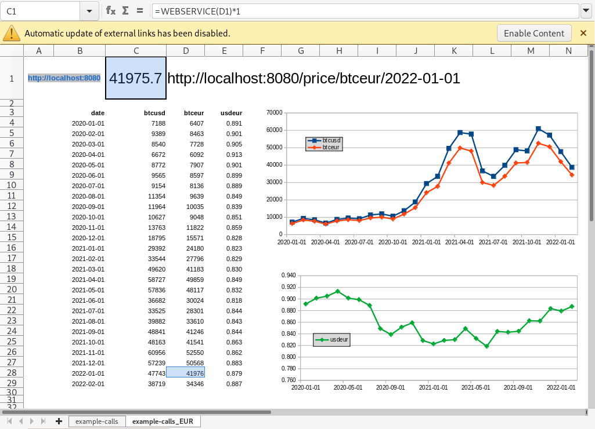

# Welcome to btceurhist

A simplistic endpoint app to deliver historical BTCEUR prices, into e.g. LibreOffice Calc.

## Quickstart
Save [your App_ID](https://openexchangerates.org/signup/free) to [OPENEXCHANGERATES](./btceurhist/OPENEXCHANGERATES), then

```
make virtualenv

source .venv/bin/activate
python -m btceurhist startserver

rm .venv -r
```
## More info
```
make virtualenv

source .venv/bin/activate
make docs

rm .venv -r
```
Note that this is the first time that I have been using the `python-project-template` suggested by github, and there are tons of files which I haven't even touched. See e.g. [README_template.md](README_template.md).

My stuff is in these folders: [btceurhist/](btceurhist/), [views/](views/), [static/](static/), and in [docs/](docs/).

## Purpose
Problems: LibreOffice can still not process JSON answers, crazily. Plus, Coindesk gives BTCUSD not BTCEUR historical data. Now, with this little project we provide the simplest possible **"BTCEUR price on day XYZ"** in LibreOffice, using its =WEBSERVICE(url) command: 



## Status
First time with **github actions**, very exciting. *Learning by doing* this with [the standard Python project template](https://github.com/rochacbruno/python-project-template) was another reason for this project. 

And yessss ... eventually I got the linter and the tests all returning with no issues.

And that means, the [CI action](https://github.com/drandreaskrueger/btceurhist/actions) (continous integration) is [succeeding for my project, on Feb 15th 2022](https://github.com/drandreaskrueger/btceurhist/actions/runs/1849699477). 

Hoooray.