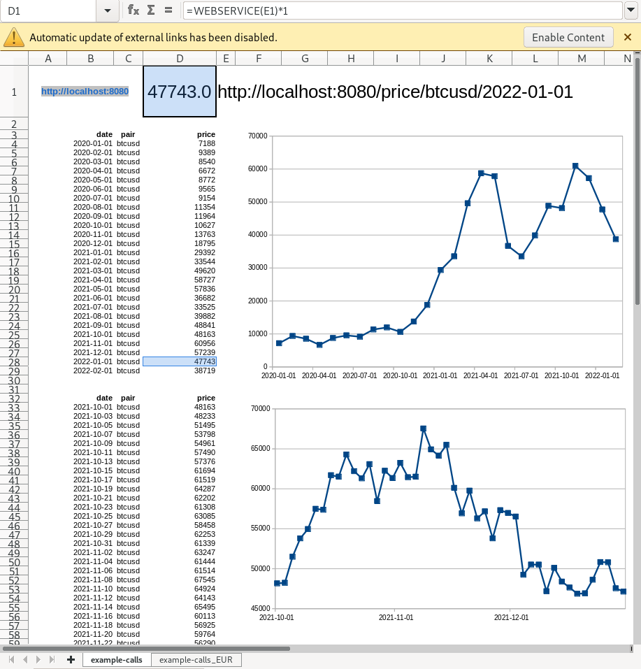

# Welcome to btceurhist

A simplistic endpoint app to deliver historical BTCEUR prices, into e.g. LibreOffice Calc.

## Commands

1. `./virtualenv.sh` = creates venv at `../../env/btceurhist`, and installs python packages
2. save [your own App_ID](https://openexchangerates.org/signup/free) into [../btceurhist/OPENEXCHANGERATES](../btceurhist/OPENEXCHANGERATES) 
3. `startserver.sh` = activates venv and runs server, with output to stdout and to LOGGING.txt

## Examples

* [http://localhost:8080/price/btcusd/2021-01-01](http://localhost:8080/price/btcusd/2021-01-01)
* LibreOffice: example call: `=WEBSERVICE("http://localhost:8080/price/btcusd/2021-01-01")`
* Libreoffice: example file: [example-call-WEBSERVICE_libreoffice.ods](example-call-WEBSERVICE_libreoffice.ods) = see below

## relevant files
* [SAVE_ALL_ANSWERS.csv](../btceurhist/SAVE_ALL_ANSWERS.csv) = cache of previous answers, so that same (pair, date) needs not be queried again
* [LOGGING.txt](../LOGGING.txt) = server log, contains all calls, and possible errors
* [OPENEXCHANGERATES](../btceurhist/OPENEXCHANGERATES) = auth APP_ID for `queries.py` --> `usdeur()` = get [here for free](https://openexchangerates.org/signup/free)

## Usage examples
### btcusd

### btcusd, usdeur, btceur

